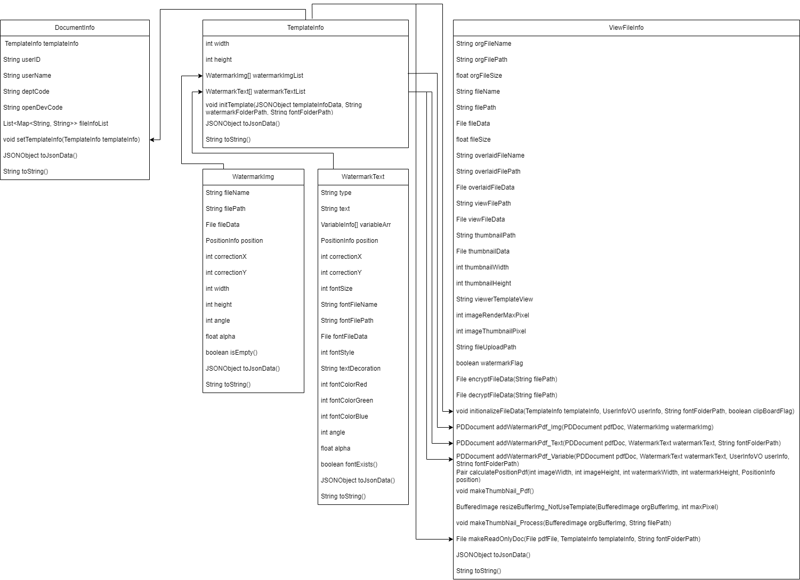
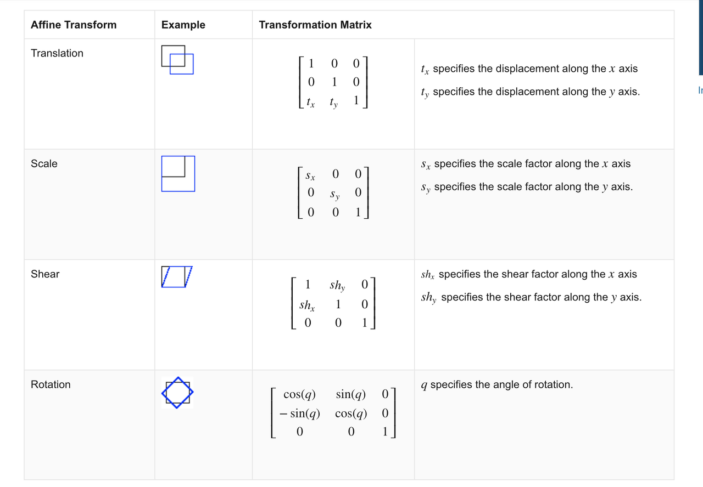
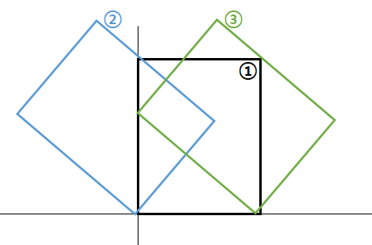
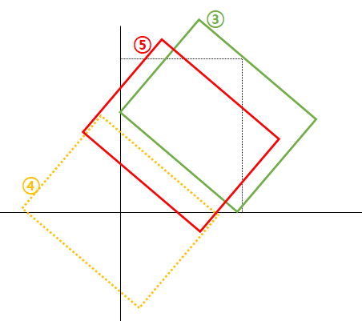

>로직
---
1. 문서정보, 탬플릿 정보, 파일정보를 클래스화하여 유기적으로 처리되도록 구현
2. 문서정보
3. 탬플릿 정보
4. 파일 정보

>>클래스 다이어그램



>>개발 내용
* html로 구현한 탬플릿 에디터와 java의 pdfbox의 이미지 처리 방식차이를 동일하게 처리하도록 구현
* pdfbox내에서도 이미지와 텍스트의 처라 방식 차이 구분 필요
* 읽기 전용 파일 생성로직 구현
* 원래는 이미지 뷰어 처리도 있었다... 이미지 처리는 또 pdfbox와 다르다...
1. Html과 pdfbox의 이미지 처리 방식 파악
    - HTML
        * 이미지 회전 축 : 이미지 중앙
        * 텍스트 처리
            - 기울임, 굵게, 밑줄, 취소선 처리가 attribute에서 지원
            - 회전 축 : 텍스트박스 중앙
    - pdfbox
        * 이미지 회전 축 : 페이지 좌측 하단 기준
        * 이미지 Y축 : + 방향
        * 텍스트 처리
            - 굵기 폰트 : 별도폰트 지정 필요 또는 별도의 선을 덧씌움
            - 기울임 처리 : 별도 개발 필요
            - 밑줄, 취소선 처리 : 별도 개발 필요
            - 회전 축 : 페이지 좌측 하단 기준
        * 텍스트 Y축 : - 방향

2. 워터마크 처리의 이론
    - affine transform
        * 이거때문에 잊고있던 선형대수를 다시 공부했다..


        * 간단히 말하면 Translation(이동), Scale(크기변형), Shear(전단->기울임), Rotation(회전) 을 사용할텐데 이를 복합사용시 배열을 곱하면 된다.
        * 다행히 pdfbox에선 이 내용들을 함수로 제공해준다. shear 빼고...
```java
Matrix rotationMatrix = Matrix.getRotateInstance(atRadDegree, 0, 0);
Matrix rollbackMatrix = Matrix.getTranslateInstance(rollbackX, rollbackY);
Matrix shearMatrix = new Matrix(1, 0, shearDegree, 1, 0, 0);
Matrix combinedMatrix = rotationMatrix.multiply(rollbackMatrix).multiply(rollbackMatrix2).multiply(translationMatrix);
```

3. 이미지 처리
    - pdfbox에서의 이미지 처리를 html과 같이 변형한다.
    - 로직
        1. 회전
            - 1.1. 회전 후 각 꼭지점이 모서리로 가도록 이동한다.


            - 1.2. 그 다음 html기준으로 회전이 되었던 것 처럼 이미지 위치를 이동한다.

        2. 이동
            - 지정된 위치와 보정값을 연산하여 추가이동 로직을 실행한다.

4. 텍스트 처리
    - pdfbox에서의 텍스트 처리를 html과 같이 변형한다.
    - 로직
        1. 회전
            - 1.1. 회전 후 각 꼭지점이 모서리로 가도록 이동한다.
            - 1.2. 그 다음 html기준으로 회전이 되었던 것 처럼 이미지 위치를 이동한다.
        2. 이동
            - 지정된 위치와 보정값을 연산하여 추가이동 로직을 실행한다.
        3. 기울임
            - pdfbox는 텍스트 기울임 기능을 지원하지 않는다. 따라서 별도 개발해야 한다.
            - 기울임 처리는 Y축의 변동이 없으므로 배열 선언시 ShearX값만 부여한다.
        
