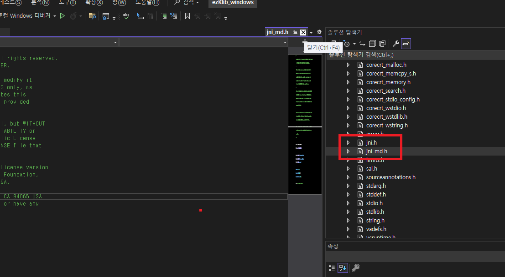

>로직
---
1. C로 구성된 암호화 라이브러리를 JNI 처리
2. JNI(java)
3. JNI(C)
4. JNI(build)

>>JNI(java)
* JNI 처리를 하가위한 java소스
```java
package egovframework.common.util;
@Component
public class KlibUtil {
private static class KlibCipher implements Cipher {
    @Override
    public native byte[] encrypt(byte[] originBytes);
    @Override
    public native byte[] decrypt(byte[] encryptedBytes);
}
```

>>JNI(C)
* JNI 처리를 하가위한 C소스
* 규격에 맞는 함수명 구성 필요
* JAVA_패키지경로_클래스명_00024하위클래스명_함수명
* 00024는 $의 치환문자이다.
```C
JNIEXPORT jbyteArray JNICALL Java_egovframework_common_util_KlibUtil_00024KlibCipher_encrypt
  (JNIEnv *, jobject, jbyteArray);

JNIEXPORT jbyteArray JNICALL Java_egovframework_common_util_KlibUtil_00024KlibCipher_decrypt
  (JNIEnv *, jobject, jbyteArray);
```

>>JNI(build)
* C/C++로 구현한 라이브러리 빌드
* OS별로 구분
* 이 자료에서는 Windows : visual studio2022/ linux : CentOS 7 환경에서 빌드
1. windows
    - jni.h, jni_md.h를 외부 종속성 추가
    
    

    - 경로는 'JDK 경로/include'
    - 빌드는 서버 구동 OS에 맞게 빌드(32bit/64bit)
2. linux
    - 여기는 빌드할때 별도의 참조 설정이 필요하다. 
    - 환경변수를 설정했다면 JAVA_HOME으로 JDK 경로 설정해도된다..
    - /usr/lib/jvm/java-1.8.0-openjdk-1.8.0.402.b06-1.el7_9.x86_64/include
    - /usr/lib/jvm/java-1.8.0-openjdk-1.8.0.402.b06-1.el7_9.x86_64/include/linux
    ```
    gcc -I/usr/lib/jvm/java-1.8.0-openjdk-1.8.0.402.b06-1.el7_9.x86_64/include -I/usr/lib/jvm/java-1.8.0-openjdk-1.8.0.402.b06-1.el7_9.x86_64/include/linux  -lklib -c -fPIC egovframework_common_util_KlibUtil_KlibCipher.c
    gcc -shared -o libezKlib.so -lklib  egovframework_common_util_KlibUtil_KlibCipher.o
    ```

>>load
* 빌드한 라이브러리를 로드한다.
```java
Path libraryPath = Paths.get(servletContext.getResource(libPath).toURI());
//log.debug("libraryPath : " + libraryPath);

// native library load
System.load(libraryPath.toString());
```
