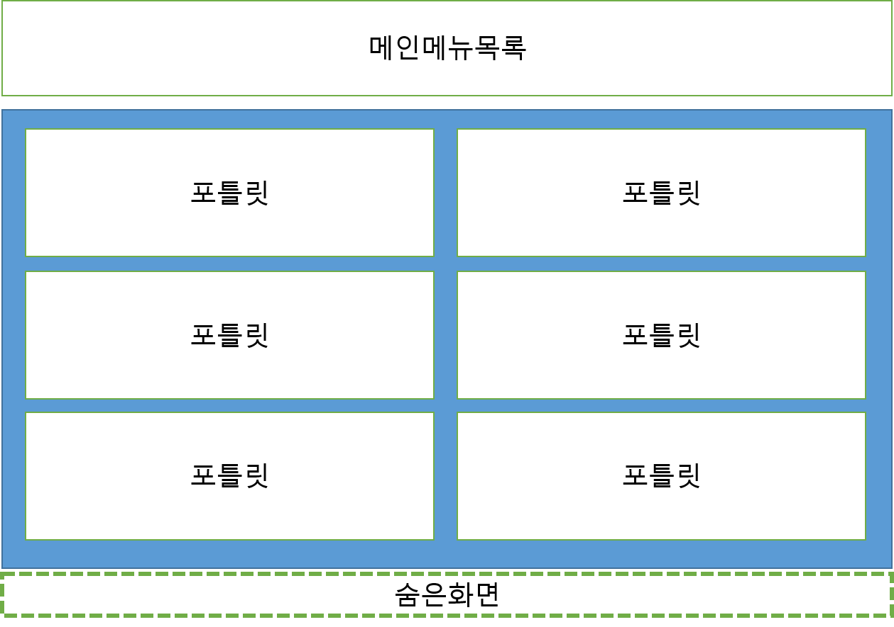

>로그인처리
---
1. DB 확인 -> SSO 초기화/인증 -> 세션에 komsaUserVo 형태로 데이터를 넣음
2. 인증 확인은 세션에서 확인
```java
//helper 호출
KomsaUserVO komsaUserVO = (KomsaUserVO) KomsaUserHelper.getAuthenticatedUser();
```
```java
//helper 내부
public static Object getAuthenticatedUser() {
    if (cmnComUserService.getAuthenticatedUser() == null) {
        return new KomsaUserVO();
    }
    return cmnComUserService.getAuthenticatedUser();
}
```
```java
//세션 확인
public Object getAuthenticatedUser() {
    return RequestContextHolder.getRequestAttributes().getAttribute("komsaUserVO", RequestAttributes.SCOPE_SESSION);
}
```
>화면구성
---
    * 메인
        1. 메인메뉴 목록 : 메인메뉴 클릭 시 각 항목에 맞는 페이지로 이동
        2. 포틀릿 : ajax를 통해 데이터를 불러옴
        3. 숨은화면 : SSO 세션 갱신 및 activex 호출을 위한 화면 




    * 메뉴 화면 공통
        1. 상단메뉴 : 홈, 메인메뉴 이동, sms전송등의 메뉴 구성
        2. 서브메뉴 : 서브메뉴 이동
        3. 좌측메뉴 : 서브메뉴 하위항목 구성
        4. 탭 영역 : 각 화면은 탭(tabObject)으로 분리되어있으며 이동이 가능
```js
//tabobject 구조체
tabObject:function(objStr){
    var tabObjStr = $(__activeTabObj).data("tabPageObject");
    var tabObjStrList = [];
    var objStrList = [];
    if(this.isEmpty(tabObjStr)){
        tabObjStr = "";
    }
    if(this.isNotEmpty(tabObjStr)){
        tabObjStrList = tabObjStr.split(",");
    }
    if(this.isNotEmpty(objStr)){
        objStrList = objStr.split(",");
    }
    $.each(objStrList,function(idx,pPbjStr){
        if(tabObjStrList.indexOf(pPbjStr) == -1 && !komsaUtil.isEmpty(pPbjStr)){
            tabObjStrList.push(pPbjStr);
        }
    });
    $(__activeTabObj).data("tabPageObject",tabObjStrList.join());
}
```
```js
//화면의 요소 탐색 시 __activeTabObj로 구분
$("#rndBbiBsnsInfoListSDate", __activeTabObj).val();
```
        5. 화면 : 작업할 내용이 구성되어있는 화면


>선박검사 처리 로직
---
1. 화면 공통(검색, DB처리)
    * form 내부의 파라미터들을 serializeObject() 함수를 통해 전달
    * serializeObject() 함수로 파라마터의 내용은 name로 구분
        - param.'name' = value;
    * 파라미터가 잔존해야하는 경우 model -> \<input type="hidden"> 에 값 삽입
```js
var param = $("form[name='searchForm']",__activeTabObj).serializeObject();
```
2. 선박검사 프로세스


>전자결재 연동
---
1. 그룹웨어
    * 기본 프로세스는 표준과 동일
    * ezApprovalSHIPDAO.getConnDataList(pMap) 함수 통한 추가 파라미터를 별도의 mapper로 DB에서 가져옴
    * 한글 양식의 필드는 그룹웨어의 별도 테이블로 연동
    * end시점 연동은 선박검사쪽 페이지 호출 로 처리
```java
resultList = ezApprovalSHIPDAO.getConnDataList(pMap);
```
```java
@SuppressWarnings("unchecked")
public List<Map<String, Object>> getConnDataList(Map<String, Object> map) throws Exception {    
    String sqlMapId = "ezSHIP." + map.get("formCd");
    return sqlMapClient.queryForList(sqlMapId, map);
}
```
2. 선박검사
    * 초기 그룹웨어 호출 시 선박검사 DB에 insert
    * 그룹웨어 결재 완료시점에 선박검사 페이지 호출 시 데이터 업데이트 및 트리거로 선박검사 테이블 데이터 업데이트


>외부 솔루션
---
1. SSO
    * komsain, 그룹웨어, ERP, E감사, CBTES SSO 연동
    * 로그인 시 SSO 연동
```java
//SSO 인증처리
KomsaCommUtil.initSSO(req, res, redirectUrl);		
```
```java
//SSO 초기화
public static String initSSO(HttpServletRequest req, HttpServletResponse res, String url) {
		// 임시 SSO
		SSORspData rspData = null;
		SSOService ssoService = SSOService.getInstance();
		rspData = ssoService.ssoGetLoginData(req);	
```

    * filter에서 SSO 인증 확인 및 예외처리

```java
@Override
public void doFilter(ServletRequest request, ServletResponse response, FilterChain chain) throws IOException, ServletException {
    HttpServletRequest hRequest = (HttpServletRequest) request;
    HttpServletResponse hResponse = (HttpServletResponse) response;

    String userWhere = hRequest.getRequestURI().substring(hRequest.getContextPath().length());
    String servletPath = hRequest.getServletPath();
    
    //필터로 SSO 인증 예외처리
    if (checkSessionIgnoreUrl(servletPath)) {
        chain.doFilter(request, response);
        return;
    }
```


2. ozReport
    * 선박검사 데이터 문서 조회, 또는 pdf 변환시 사용
    * 문서 조회
        * oz서버의 뷰어 페이지 호출
    * pdf 변환
        * oz서버의 스케줄러 호출 페이지 호출
        
3. DAMO
    * 개인정보 DB암호화
    * DAMO 패키지로 함수 구성


    
4. rMatechart
    * 운항관리, 통계 등에 사용
5. SMS
    * LGU+ 에서 제공하는 에이전트를 사용하며 DB INSERT 시 자동 발송

>사용 오픈소스
---
* 도로명주소
    * 사용자 생성 시 주소검색
    * juso.go.kr에서 API 다운, java에서 api 호출
```java
String jsonString = "";
String readData = "";
try {
    URL obj = new URL(jusoUrl + "?confmKey="+ jusoConfmKey + "&keyword=" + keyword + "&resultType=json" + (("".equals(pageIndex)) ? "" : "&currentPage=" + pageIndex)); // 호출할 url
    HttpURLConnection con = (HttpURLConnection)obj.openConnection();
    con.setRequestMethod("GET");
    ObjectMapper mapper = new ObjectMapper();
    in = new BufferedReader(new InputStreamReader(con.getInputStream(), "UTF-8"));
    String line;
    while((line = in.readLine()) != null) {
        // response를 차례대로 출력
        readData = line;
        mapper.getSerializerProvider().setNullValueSerializer(new NullToEmptyStringSerializer());
        jsonString = mapper.writeValueAsString(line);
    }
} catch(IOException e) {
    log.error("Exception" + e);
} catch(Exception e) {
    log.error("Exception" + e);
}
finally {
    if(in != null) try {
        in.close();
    } catch(IOException e) {
        log.error("Exception" + e);
    }
}
```
* itextpdf
    * 기사란 html -> pdf 변환시 사용
```java
public String createTextToPdf(String path, String content, String fontPath) {
    File file = new File(path);
    Document document = null;
    try {
        file.getParentFile().mkdirs();
        PdfWriter writer = new PdfWriter(path);
        PdfDocument pdf = new PdfDocument(writer);
        document = new Document(pdf);
        PdfFont pdfFont = PdfFontFactory.createFont(fontPath);
        document.add(new Paragraph(content).setFont(pdfFont));
    }catch(Exception e) {
        e.printStackTrace();
    }finally {
        if(document!=null) {
            document.close();
        }
    }
    if(file.exists()) {
        // 생성된 파일이 존재 할 경우, full 경로
        return file.toString();
    }else {
        // 파일이 존재하지 않을 경우, 공백
        return "";
    }
}
```
* pdf.js
    * edms 에서 pdf 문서 조회 시 사용
>기타 작업내용
-------
 * 추가 확인 필요사항
   * 세금계산서 연동
   * pdf 뷰어
   * 배치 구동 방식


   * 로깅처리
   
   